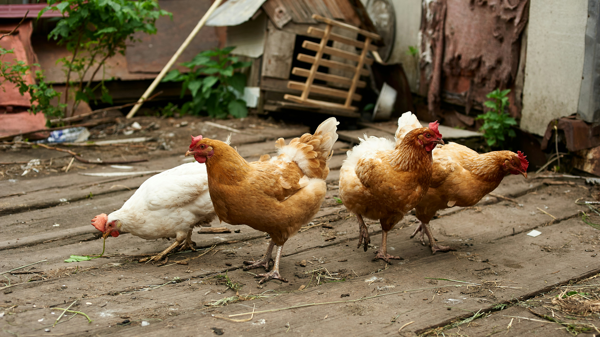
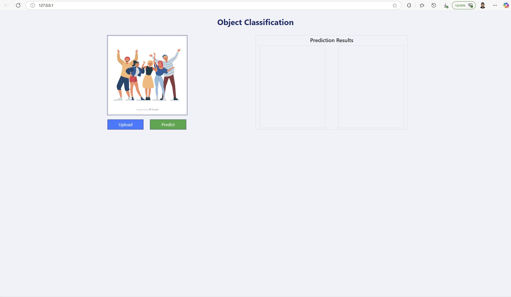
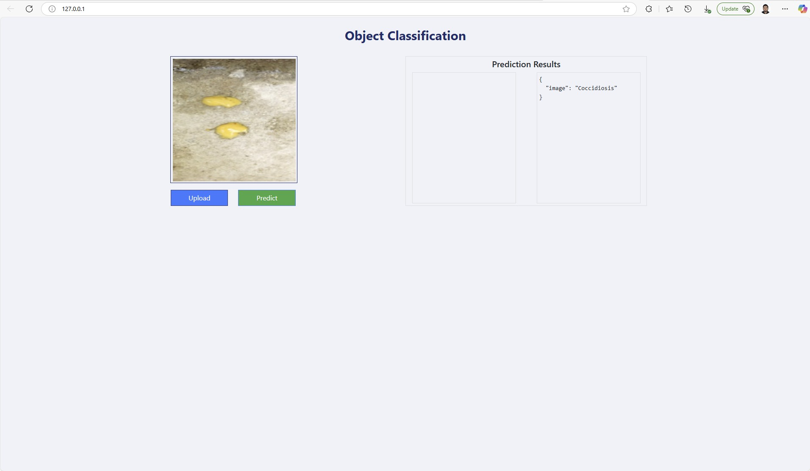

Photo by <a href="https://unsplash.com/@antomalani?utm_content=creditCopyText&utm_medium=referral&utm_source=unsplash">Anton Malanin</a> on <a href="https://unsplash.com/photos/brown-and-white-hen-on-ground-RSW0UMbIkz8?utm_content=creditCopyText&utm_medium=referral&utm_source=unsplash">Unsplash</a>
      


[](https://github.com/ellerbrock/open-source-badges/)

Badge [source](https://shields.io/)

# Chicken Disease Classification

In this project we are developing Flask Application which can predict whether the Chicken has effected with Coccidiosis Disease. This is an end to end Machine learning portfolio project which involves the Model Development and Model training. Machine Learning Project is implemented with MLOps and CI/CD pipelines. MLOps consists of Data Ingestion, Data Transformation, Model Trainer, Model Evaluation and Model Deployment. 

## Authors

- [Samith Chimminiyan](https://www.github.com/samithcsachi)

## Table of Contents

- [Authors](#Authors)
- [Table of Contents](#table-of-contents)
- [Problem Statement](#problem-statement)
- [Tech Stack](#tech-stack)
- [Data source](#Data-source)
- [Quick glance at the results](#Quick-glance-at-the-results)
- [Lessons learned and recommendation](#lessons-learned-and-recommendation)
- [Limitation and what can be improved](#limitation-and-what-can-be-improved)
- [Run Locally](#run-locally)
- [Explore the notebook](#explore-the-notebook)
- [Contribution](#contribution)
- [License](#license)

## Problem Statement 

This app predicts the Chicken has effected with Coccidiosis Disease by uploading the Images of Chicken. 


## Tech Stack

- pandas
- tensorflow
- numpy
- pandas
- matplotlib
- seaborn
- dvc
- notebook
- python-box
- pyYAML
- tqdm
- ensure
- joblib
- types-pyYAML
- scipy
- flask
- flask-cors

## Data source

Data Source Link : - [https://github.com/entbappy/Branching-tutorial/raw/master/Chicken-fecal-images.zip](https://github.com/entbappy/Branching-tutorial/raw/master/Chicken-fecal-images.zip)

- Data contains the Images of Healthy and Coccidiosis disease effected Chicken fecal images. 

## Quick glance at the results

Main Welcome Screen of the Website



Final Results of the Model




- ***Tenserflow Kera model VGG16 was used for training***


## Run Locally
Initialize git

```bash
git init
```

Clone the project

```bash
git clone https://github.com/samithcsachi/Chicken-Disease-Classification.git
```

Open Anaconda Prompt and Change the Directory and Open VSCODE by typing code .

```bash
cd E:/Chicken-Disease-Classification

```

Open the command prompt in VSCODE

```bash
conda create -n cnncls python=3.8 -y
```
Activate the conda environment

```bash
conda activate cnncls
```

List all the packages installed

```bash
conda list
```
Install the packages in Requirements file. 

```bash
pip install -r requirements.txt
```
Run the application 

```
python app.py

```


## Explore the notebook

GitHub :  [https://github.com/samithcsachi/Chicken-Disease-Classification](https://github.com/samithcsachi/Chicken-Disease-Classification)

## Contribution

Pull requests are welcome! For major changes, please open an issue first to discuss what you would like to change or contribute.

## License

MIT License

Copyright (c) 2025 Samith Chimminiyan

Permission is hereby granted, free of charge, to any person obtaining a copy
of this software and associated documentation files (the "Software"), to deal
in the Software without restriction, including without limitation the rights
to use, copy, modify, merge, publish, distribute, sublicense, and/or sell
copies of the Software, and to permit persons to whom the Software is
furnished to do so, subject to the following conditions:

The above copyright notice and this permission notice shall be included in all
copies or substantial portions of the Software.

THE SOFTWARE IS PROVIDED "AS IS", WITHOUT WARRANTY OF ANY KIND, EXPRESS OR
IMPLIED, INCLUDING BUT NOT LIMITED TO THE WARRANTIES OF MERCHANTABILITY,
FITNESS FOR A PARTICULAR PURPOSE AND NONINFRINGEMENT. IN NO EVENT SHALL THE
AUTHORS OR COPYRIGHT HOLDERS BE LIABLE FOR ANY CLAIM, DAMAGES OR OTHER
LIABILITY, WHETHER IN AN ACTION OF CONTRACT, TORT OR OTHERWISE, ARISING FROM,
OUT OF OR IN CONNECTION WITH THE SOFTWARE OR THE USE OR OTHER DEALINGS IN THE
SOFTWARE.

Learn more about [MIT](https://choosealicense.com/licenses/mit/) license

## Contact
If you have any questions, suggestions, or collaborations in data science, feel free to reach out:
- 📧 Email: [samith.sachi@gmail.com](mailto:samith.sachi@gmail.com)
- 🔗 LinkedIn: [www.linkedin.com/in/samithchimminiyan](https://www.linkedin.com/in/samithchimminiyan)
- 🌐 Website: [www.samithc.com](https://www.samithc.com)
# Chicken-Disease-Classification